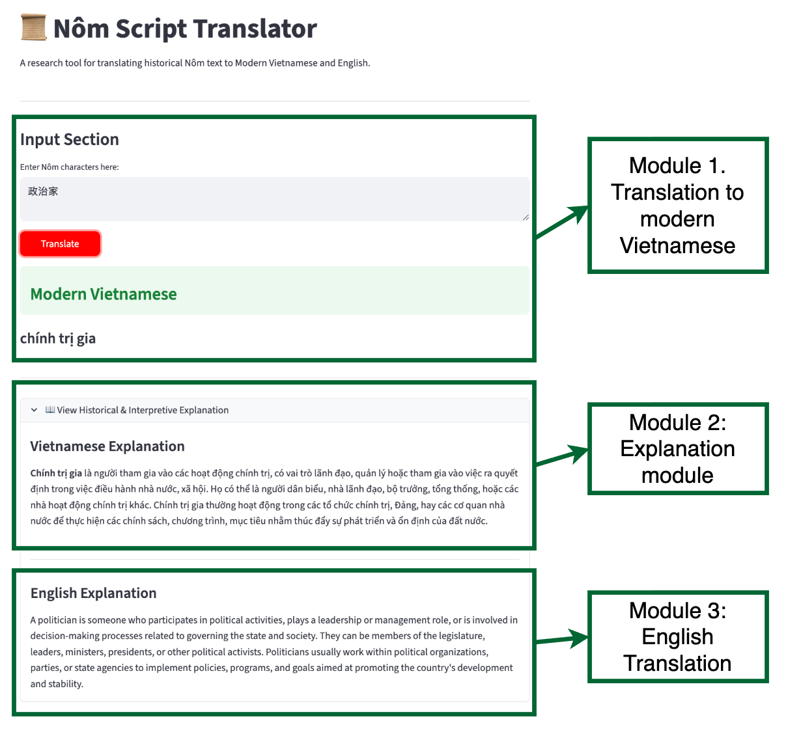
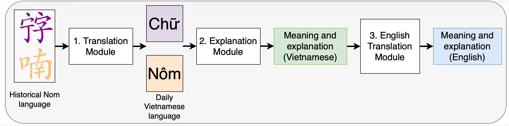

# 𡨸喃 (Hán-Nôm) to Vietnamese Converter

A specialized Streamlit application designed to bridge the gap between historical Hán-Nôm script and modern Vietnamese (Quốc ngữ). This tool allows users to select predefined Nôm character strings and view their modern equivalents.

## 🚀 Live Demo


## 🖼️ Application Overview
The application features a clean, user-friendly interface built with Streamlit. It includes a filtered selection system to ensure only valid, renderable Unicode characters are processed.


*Figure 1: The main interface showing the selection and translation section.*

## ⚙️ Architecture
The project follows a modular Python-based architecture, utilizing Streamlit for the frontend and a dictionary-based mapping system for character conversion.


*Figure 2: Data flow from raw input through the filtering logic to the UI.*

## Installation & Local Development
If you want to run this project locally:

1. **Clone the repository:**
   ```bash
   git clone [https://github.com/NguyenThaiVu/nom_vietnamese](https://github.com/NguyenThaiVu/nom_vietnamese)
   cd your-repo-name
   ```

2. **Install dependencies:**
   ```bash
   pip install -r requirements.txt
   ```

3. **Run the app:**
   ```bash
   streamlit run your_app.py
   ```